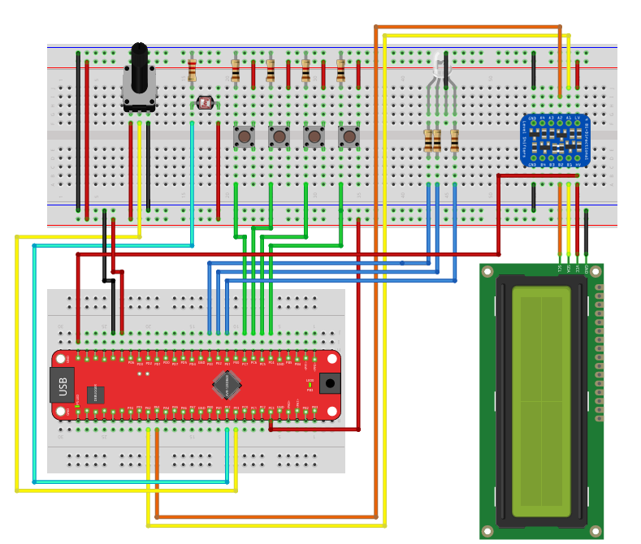

# Project 4: ADC & USART

This project combines Analog-to-Digital Conversion (ADC) with Serial Communication (USART). It demonstrates how to read sensors, process analog data, and exchange information with a PC or other devices.

## 📋 Prerequisites

* **Library:** The LCD-based exercises (`7.1` and `7.2`) require `I2C_LCD.h` and `I2C_LCD.c`.
* **Hardware:**
    * AVR128DB48 Board.
    * 10kΩ Potentiometer (Connected to PF3).
    * Photoresistor Circuit (Connected to PF2).
    * Push Buttons (Port C).
    * RGB LED (Port E).
    * USB-UART Bridge (Built into the Curiosity Nano via PB0/PB1).

## 🔌 Hardware Setup

The following diagram illustrates the complete wiring setup for all exercises in this project.

## 📂 Exercises (Praktikums)

### 1. ADC Potentiometer (`main_adc_potantiometer.c`)
**Goal:** Read an analog voltage and display it.
* **Description:** Reads the voltage from a potentiometer connected to **PF3 (AIN19)**.
* **Key Concepts:**
    * **ADC Configuration:** Sets up `ADC0` with 12-bit resolution and VDD (3.3V) reference.
    * **Calculations:** Converts the raw 12-bit value (0-4095) into millivolts using integer math to avoid floating-point overhead on the 8-bit CPU.

### 2. ADC Photoresistor (`main_adc_photoresistor.c`)
**Goal:** Create a light sensor application.
* **Description:** Reads a photoresistor on **PF2 (AIN18)** and displays the light level as a percentage.
* **Key Concepts:**
    * **Calibration:** Adjusts the 100% threshold based on the specific voltage divider circuit (max 2.9V in this setup).
    * **Hysteresis:** Updates the LCD only when the value changes to prevent flickering.

### 3. USART Buttons (`main_usart_buttons.c`)
**Goal:** Send data *from* the microcontroller *to* a PC.
* **Description:** Detects button presses on Port C and sends a corresponding message (e.g., "Button C4 Pressed!") to the PC via Serial (9600 baud).
* **Key Concepts:**
    * **Ring Buffer (FIFO):** Implements a 128-byte circular buffer. This allows the main code to "print" fast without waiting for the slow UART hardware to finish sending every byte.
    * **Interrupt Driven:** The `USART3_DRE_vect` ISR handles the actual transmission in the background.

### 4. Internal Temperature (`main_usart_internal_temperature.c`)
**Goal:** Read the chip's internal sensors and log data.
* **Description:** Reads the internal temperature sensor and sends a log string (`T: 10s | 300 K | 27 C`) every second.
* **Key Concepts:**
    * **Factory Calibration:** Reads the `SIGROW` signature row to get the factory-measured calibration data for precise temperature calculation.
    * **Event System Logic:** Uses a Timer (`TCB0`) to trigger the ADC start flag, and the ADC ISR to trigger the UART transmission, creating a fully non-blocking chain of events.

### 5. RGB LED Control (`main_usart_rgb-led_control.c`)
**Goal:** Receive data *from* a PC to control hardware.
* **Description:** Listens for a 6-character Hex string (e.g., `FF0000` for Red) sent from a PC terminal and updates the RGB LED color.
* **Key Concepts:**
    * **Parsing:** Buffers incoming characters until 6 valid hex digits are received, then parses them into R, G, B integer values.
    * **PWM Integration:** Uses the parsed values to update the `TCA0` Compare Registers directly.
