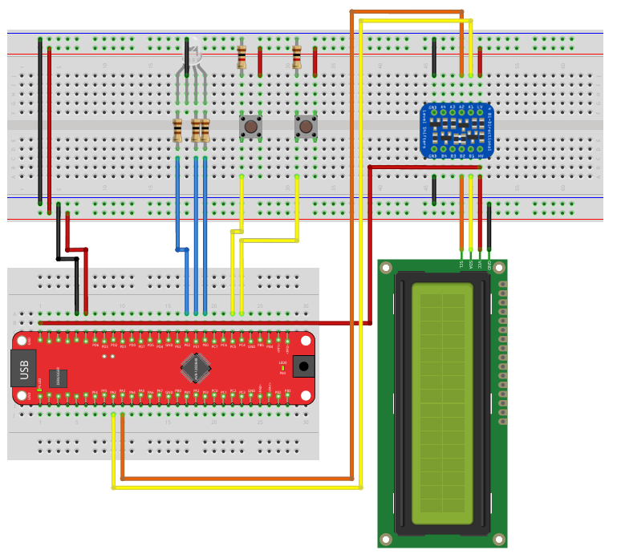

# Project 2: Interrupts & Timers

This project moves beyond simple loops and introduces **Interrupt Service Routines (ISRs)**. The goal is to write non-blocking code where the CPU responds to events (Buttons, Time) immediately without pausing the main program.

## 📋 Prerequisites

* **Library:** The LCD-based exercises (`5.2` and `5.4`) require `I2C_LCD.h` and `I2C_LCD.c`.
* **Hardware:**
    * AVR128DB48 Board.
    * RGB LED (Connected to Port E: PE0, PE1, PE2).
    * 2 Push Buttons (Connected to Port C: PC4, PC5).
    * 16x2 LCD (for Exercises 5.2 and 5.4).

## 🔌 Hardware Setup

The following diagram illustrates the wiring for the buttons and RGB LED used in these exercises.

## 📂 Exercises (Praktikums)

### 1. Button Interrupt & Random Color (`main_button_interrupt.c`)
**Goal:** Handle button inputs without freezing the CPU (`_delay_ms`) and generate pseudo-randomness.
* **Description:** Toggles an RGB LED to a random color when a button (PC4) is pressed.
* **Key Concepts:**
    * **Timer Polling:** Uses **TCA0** (Timer Counter A) to trigger an overflow interrupt every 1ms.
    * **Debouncing:** The ISR checks the button state and only registers a press if it remains stable for 10ms.
    * **PRNG:** Implements the **Xorshift32** algorithm to generate random numbers for the color generation.

### 2. Basic Timer (`main_timer.c`)
**Goal:** Create a precise digital clock using hardware timers.
* **Description:** Counts seconds and displays them on the LCD.
* **Logic:**
    * Uses **TCB0** (Timer Counter B) in Periodic Interrupt Mode to generate a 1ms "Tick".
    * The ISR counts milliseconds; when 1000ms is reached, it sets a global flag `G_Second_Changed`.
    * The `main()` loop updates the LCD only when the flag is set, keeping the display responsive.

### 3. Traffic Light Controller (`main_traffic_light.c`)
**Goal:** Implement a Finite State Machine (FSM) with timing and external inputs.
* **Description:** Simulates a traffic light (Red -> Red/Yellow -> Green -> Yellow -> Red).
* **Controls:**
    * **PC4:** Request Green.
    * **PC5:** Request Red.
* **Key Concepts:**
    * **State Machine:** Uses an `enum` and `switch-case` to manage logic states.
    * **Non-Blocking Architecture:** The CPU does not wait inside the states. **TCB0** handles the countdown timers in the background, allowing instant button reaction even during long light phases.

### 4. Programmable Timer (`main_programmable_timer.c`)
**Goal:** A fully functional countdown timer with user controls.
* **Description:** A kitchen-timer style application that counts down from a set time.
* **Controls:**
    * **PC5 (Start/Pause):** Toggles the timer state.
    * **PC4 (Add Time):** Adds 5 seconds to the counter.
* **Key Concepts:**
    * **Critical Sections:** Uses `cli()` and `sei()` to protect shared variables (like `G_Remaining_Seconds`) from being corrupted when accessed by both the Main Loop and the ISR simultaneously.
    * **Visual Feedback:** Changes LED color based on state (Red=Paused, Green=Running, Blue=Expired).
