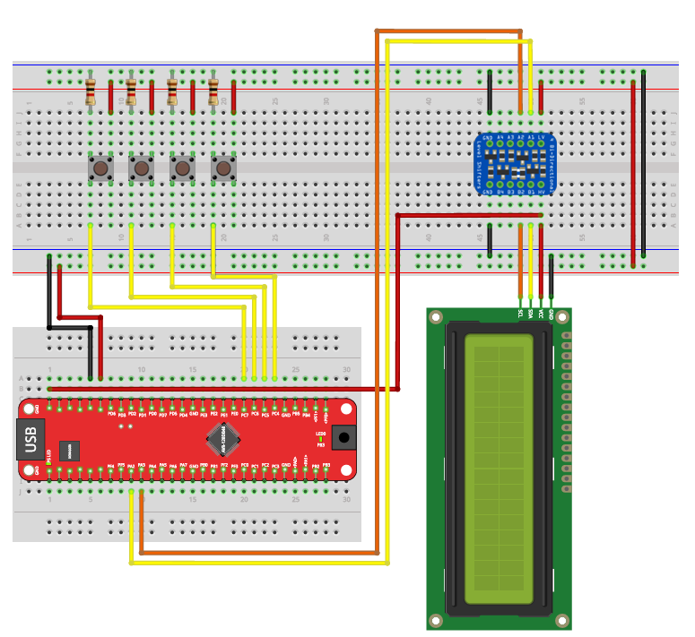

# Project 1: LCD Control

This project focuses on interfacing the **AVR128DB48** with a standard **16x2 LCD** using the **I2C protocol**. It progresses from basic text display to complex animations and interactive user input handling.

## 📋 Prerequisites

* **Library:** All examples require `I2C_LCD.h` and `I2C_LCD.c` to be included in your project.
* **Hardware:**
    * AVR128DB48 Board.
    * 16x2 LCD with I2C Backpack.
    * Push buttons (for the Calculator exercise) connected to Port C.

## 🔌 Hardware Setup

The following diagram illustrates the wiring connection between the AVR128DB48 Curiosity Nano, the Logic Level Shifter, the Buttons, and the LCD Screen.

## 📂 Exercises (Praktikums)

### 1. Hello Display (`main_hello_display.c`)
**Goal:** Verify hardware connections and library functionality.
* **Description:** Initializes the I2C bus and the LCD, then prints the string `"Hello Display"` on the second line (Row 1).
* **Key Concepts:**
    * `lcd_init()`: Setting up the I2C communication.
    * `lcd_moveCursor(x, y)`: Positioning text.
    * `lcd_putString()`: Sending character arrays.

### 2. Count Up (`main_count_up.c`)
**Goal:** Display dynamic integer data.
* **Description:** Implements a counter that increments indefinitely.
* **Logic:**
    * Converts the integer `Counter` to a string manually using a `to_str()` helper function.
    * Calculates the string length to dynamically adjust the cursor position (right-alignment logic) before printing.
    * Updates the screen inside the main `while(1)` loop with a delay.

### 3. Ping Pong Animation (`main_ping_pong.c`)
**Goal:** Create visual animations using cursor manipulation.
* **Description:** A "Ball" (represented by the character `'1'`) bounces across the screen against a background of `'0'`s.
* **Animation Pattern:**
    1.  Fills the entire screen with `'0'`.
    2.  Moves left-to-right on **Row 0**.
    3.  Moves right-to-left on **Row 1**.
* **Key Concepts:**
    * Visual persistence (clearing the "old" character after moving to the new position).
    * Nested loop structures for coordinate management.

### 4. Binary Calculator (`main_binary_calculator.c`)
**Goal:** Interactive input handling and bitwise operations.
* **Description:** A signed integer calculator controlled by 4 buttons. The result is updated on the LCD only when a change occurs.
* **Controls (Port C):**
    * **PC4:** Increment (`+1`)
    * **PC5:** Decrement (`-1`)
    * **PC6:** Multiply by 2 (Left Bit-Shift `<< 1`)
    * **PC7:** Divide by 2 (Right Bit-Shift `>> 1`)
* **Key Concepts:**
    * **Debouncing:** Implements `single_button_debounce_filter()` to prevent false triggering.
    * **Bit Manipulation:** Uses bitwise shifts for multiplication/division.
    * **Efficiency:** Uses a `result_changed` flag to refresh the LCD *only* when necessary, preventing flickering.
