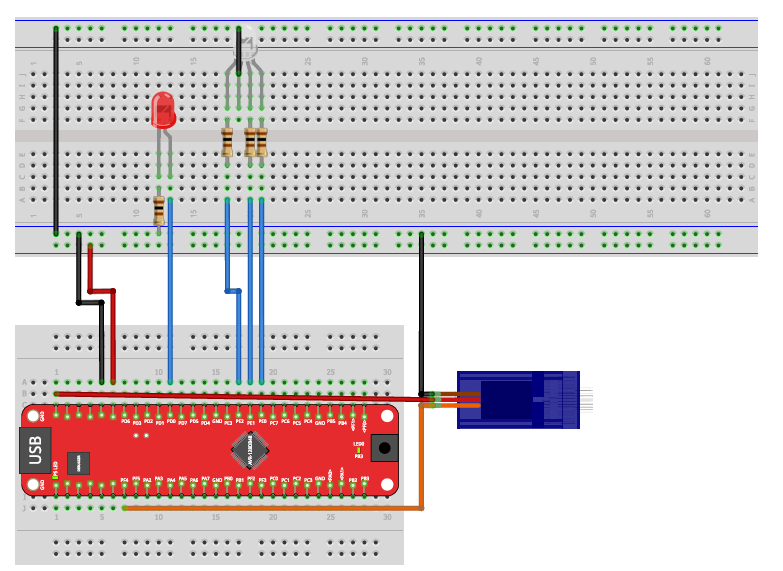

# Project 3: Pulse Width Modulation (PWM)

This project explores using the AVR128DB48's hardware timers (`TCA0` and `TCB0`) to generate **Pulse Width Modulated (PWM)** signals. These signals are used to control the brightness of LEDs and the position of a servo motor.

## 📋 Prerequisites

* **Hardware:**
    * AVR128DB48 Board.
    * RGB LED (Connected to Port E: PE0, PE1, PE2).
    * Red LED (Connected to Port D: PD0) - *For Exercise 6.1*.
    * Servo Motor (Connected to Port F: PF4).

## 🔌 Hardware Setup

The following diagram illustrates the wiring for the RGB LED, Red LED, and Servo Motor.

## 📂 Exercises (Praktikums)

### 1. Dimming Red LED (`main_dimming_red_led.c`)
**Goal:** Control LED brightness using Hardware PWM.
* **Description:** Sets a Red LED to a specific brightness (e.g., 25%) by varying the duty cycle.
* **Key Concepts:**
    * **TCA0 (Single-Slope PWM):** Configures Timer A in `DSBOTTOM` mode to generate a waveform automatically without CPU intervention.
    * **Port Multiplexing (`PORTMUX`):** Routes the TCA0 waveform output (WO0) to Pin **PD0** instead of the default pin.
    * **Math:** Calculates the 8-bit compare value using the formula: `(Percentage / 100.0) * 256.0 - 1`.

### 2. Rainbow LED (`main_rainbow_led.c`)
**Goal:** Create a color-mixing animation by controlling three PWM channels simultaneously.
* **Description:** Cycles the RGB LED through the color spectrum (Red -> Green -> Blue -> Red).
* **Logic:**
    * **Dual Timers:**
        * **TCA0:** Generates the high-speed PWM signals for Red (PE0), Green (PE1), and Blue (PE2) in the background.
        * **TCB0:** Generates a 50ms system interrupt to update the color values.
    * **Color Wheel:** Implements a 3-phase transition logic (e.g., Phase 0: Red decreases, Green increases) to create smooth transitions.

### 3. Waving Servomotor (`main_waving_servomotor.c`)
**Goal:** Control a servo motor using precise timing pulses.
* **Description:** Sweeps a servo arm back and forth between "Left" (1ms pulse) and "Right" (2ms pulse).
* **Key Concepts:**
    * **Software PWM:** Unlike the LEDs, the servo requires a very specific 20ms period (50Hz). This is implemented manually using the **TCB0** interrupt.
    * **Interrupt Logic:** The ISR handles the signal generation:
        1.  Sets Pin HIGH -> Waits for `Pulse_Width` cycles.
        2.  Sets Pin LOW -> Waits for the remainder of the 20ms frame.
    * **Sweep Logic:** The main loop updates the pulse width in small steps (`STEP_SIZE_us`) to create smooth motion.
