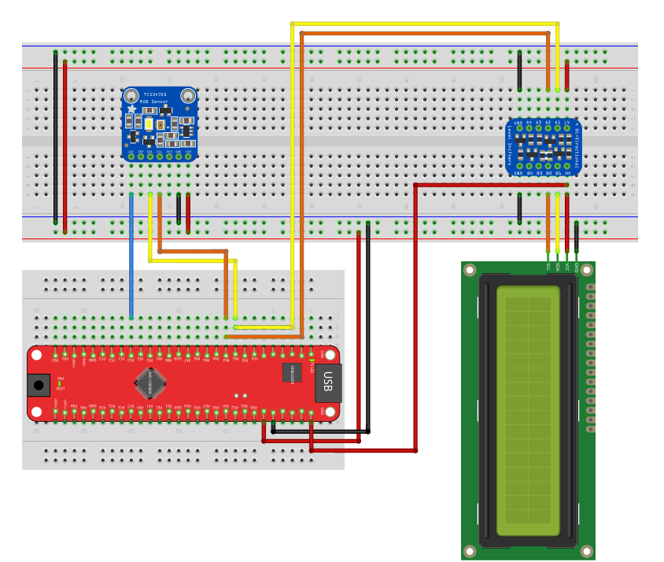

# Project 5: RGB Color Sensor

This project demonstrates how to interface with advanced digital I2C sensors. Specifically, it uses the **TCS34725** color sensor to read Red, Green, and Blue light values and displays them in hexadecimal format on an LCD.

## 📋 Prerequisites

* **Library:** This exercise requires `I2C_LCD.h` and `I2C_LCD.c` to be included in your project.
* **Hardware:**
    * AVR128DB48 Board.
    * TCS34725 Color Sensor Module (I2C Address: `0x29`).
    * 16x2 LCD.

## 🔌 Hardware Setup

The following diagram illustrates the wiring connection for the TCS34725 sensor and the LCD display. Note that both devices share the same I2C bus (SDA/SCL).

## 📂 Exercises (Praktikums)

### 1. RGB Color Sensor Driver (`main_rgb_colour_sensor.c`)
**Goal:** Write a manual I2C driver to configure and read a digital sensor.
* **Description:** Initializes the sensor, enables the internal ADC, and continuously reads 16-bit RGB data.
* **Key Concepts:**
    * **Command Bit Protocol:** The TCS34725 requires a special "Command Bit" (`0x80`) to be OR'd with the register address for every write/read operation.
    * **Auto-Increment:** Uses the protocol feature (`0x20`) to read all 6 data bytes (Low/High for R, G, B) in one continuous I2C transaction, ensuring data consistency.
    * **Initialization Sequence:**
        1.  Power On (`PON`).
        2.  Wait 2.4ms (Oscillator start).
        3.  Enable ADC (`AEN`).
    * **Data Formatting:** Uses `sprintf` with `%04X` to format the raw 16-bit integer values into clean 4-digit Hexadecimal strings for the display (e.g., `R:01A5`).
